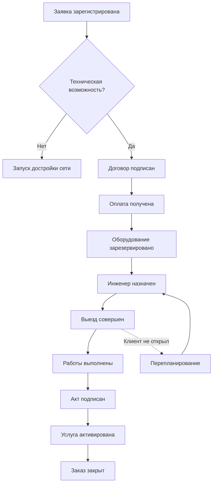

# Event Storming: Предметная область "Подключение проводного домашнего интернета"

## Результаты воркшопа

### 1. Доменные события (Domain Events)

> *Оранжевые стикеры. Фиксируют факты, которые произошли и важны для бизнеса.*

| Событие | Описание |
|---------|---------|
| **Заявка зарегистрирована** | Клиент оставил заявку на сайте или по телефону |
| **Договор подписан** | Подписан договор (ЭЦП или бумажный вариант) |
| **Анкета проверена** | Скоринг пройден, отсутствуют долги по старому адресу |
| **Техническая возможность подтверждена** | Имеется свободный порт на оборудовании, дом в зоне покрытия |
| **Заказ передан в биллинг** | Создана инвойсовая операция |
| **Оплата получена** | Получен аванс или полная стоимость подключения |
| **Работы запланированы** | Сформировано окно выезда инженера |
| **Маршрут проложен** | SAPP-проект готов для монтажников |
| **Оборудование зарезервировано** | ONT/роутер закреплен за заказом на складе |
| **Инженер назначен** | Выполнено распределение по участку |
| **Выезд совершен** | Инженер отметил начало работ |
| **Работы выполнены** | Кабель заведен, розетка смонтирована |
| **Услуга активирована** | Аккаунт в RADIUS/PPPoE создан, порт поднят |
| **Акт выполненных работ подписан** | Клиент подтвердил работоспособность интернета |
| **Заказ закрыт** | Подключение завершено |

---

### 2. Команды (Commands)

> *Синие стикеры. Действия, инициирующие изменения в системе.*

| Команда | Исполнитель | Назначение |
|---------|-------------|-----------|
| **Заполнить анкету** | Клиент / Менеджер | Сбор первичных данных |
| **Проверить техническую возможность** | Менеджер / Система | Запрос в биллинговую систему / инвентарь |
| **Подписать договор** | Клиент | Юридическое оформление отношений |
| **Провести оплату** | Клиент | Финансирование подключения |
| **Сформировать наряд** | Диспетчер | Создание задания для инженера |
| **Зарезервировать порт** | Система | Фиксация сетевого ресурса |
| **Выдать оборудование** | Склад | Отгрузка ONT/роутера |
| **Создать учетную запись** | Система | Регистрация в системах доступа |
| **Активировать порт** | Инженер / NMS | Команда на сетевое оборудование |

---

### 3. Агрегаты (Aggregates)

> *Желтые стикеры. Центральные объекты, вокруг которых строится логика.*

#### Заказ на подключение (Order)
*Главный агрегат, объединяющий информацию о клиенте, адресе, услугах.*

| Статусы | Описание |
|---------|---------|
| Черновик | Начальная стадия оформления |
| Скоринг | Проверка клиента |
| Техническая проверка | Оценка возможности подключения |
| Монтаж | Выполнение работ |
| Завершен | Услуга активна |

#### Договор (Contract)
Юридический агрегат, связанный с клиентом. Содержит условия подключения и обслуживания.

#### Лицевой счет (Account / Billing Account)
Финансовый агрегат. Управляет балансом и платежами. Без положительного баланса (или аванса) активация невозможна.

#### Инженерный наряд (Work Order)
Агрегат для полевых работ. Содержит:
- Маршрут и состав работ
- Список необходимого оборудования
- Временные интервалы

#### Сетевое оборудование (Network Node / PON-port)
Физический агрегат. Отражает наличие ресурсов (свободные порты OLT, выносные сплиттеры).

---

### 4. Политики (Policies)

> *Фиолетовые стикеры. Бизнес-правила: «Если произошло А, то выполнить Б».*

| Политика | Условие | Действие |
|----------|---------|---------|
| **Скоринг клиента** | Клиент попадает в «красную зону» (высокий риск неплатежа) | Требовать 100% предоплату вместо постоплаты |
| **Техническая возможность** | На адресе отсутствуют свободные порты | Запустить процесс «Достройка сети» (капстройка) |
| **Активация услуги** | Получена оплата И подписан акт И инженер подтвердил установку | Отправить команду на активацию услуги |
| **Переиспользование оборудования** | На складе закончились новые роутеры | Выдать refurbished оборудование (с предварительным согласованием с клиентом) |

---

### 5. Проблемные зоны и болевые точки (Pain Points / Hotspots)

> *Красные стикеры. Места, где процесс ломается или требует ручного вмешательства.*

#### 1. Синхронизация портов
**Проблема:** Информация в биллинге и реальном состоянии сети (OLT) рассинхронизирована.
**Последствие:** Команда «Зарезервировать порт» падает, так как порт физически занят, хотя в системе числится свободным.

#### 2. Согласование доступа в МКД
**Проблема:** Для многоквартирных домов требуется акт с УК или ТСЖ.
**Последствие:** Процесс встает на этапе «Техническая возможность подтверждена» на неопределенный срок.

#### 3. Выезд инженера «дверь не открыли»
**Проблема:** Клиент не открывает дверь в окно подключения.
**Последствие:** Самый дорогой отказ. Вызывает перепланирование наряда и повторную отправку ресурсов.

#### 4. Неправильное подключение оборудования
**Проблема:** Клиент подключает роутер неправильно (не в тот порт) или портит кабель до подписания акта.
**Последствие:** Процесс «Работы выполнены» не переходит в «Услуга активирована» без ручного контроля техподдержки.

---

### 6. Роли и внешние системы (Actors & External Systems)

#### Роли участников

| Роль | Основные команды |
|------|------------------|
| **Клиент** | Заполнить анкету, Оплатить, Подписать акт |
| **Менеджер по продажам (B2C)** | Работа с заказом до этапа «Монтаж» |
| **Диспетчер** | Формирование нарядов, назначение инженеров |
| **Инженер (монтажник)** | Получение наряда, смена статусов (выезд, выполнение) |
| **Склад** | Выдача оборудования |

#### Внешние системы

| Система | Назначение |
|---------|------------|
| **BSS/OSS (Биллинг)** | Хранит агрегат «Лицевой счет», управляет списанием средств |
| **NMS / CLI** | Исполняет команды активации порта, создания VLAN |
| **Мобильное приложение инженера** | Доставка инженерных нарядов, фиксация статусов |

---

### 7. Границы контекстов (Bounded Contexts)

В ходе воркшопа выделены два ключевых поддомена, которые должны быть слабо связаны (с использованием антикоррупционного слоя):

#### Контекст продаж и CRM (Context A)
- **Содержание:** Заказ, Договор, маркетинговые акции, коммуникация с клиентом
- **Роль:** «Передняя часть» процесса
- **Ответственность:** Привлечение клиента, оформление, согласование условий

#### Контекст выполнения и активации (Context B)
- **Содержание:** Порты, Оборудование, Инженерные наряды, сетевая инфраструктура
- **Роль:** «Техническая часть» процесса
- **Ответственность:** Физическое подключение, активация сервиса, управление ресурсами

#### Критическая точка интеграции
Основная проблема (Hotspot) возникает на стыке контекстов:
- Менеджер продал услугу (Контекст А)
- Техническая база не может выполнить подключение из-за отсутствия физического ресурса (Контекст Б)

---

## Приложение: Схема процесса (Mermaid)

