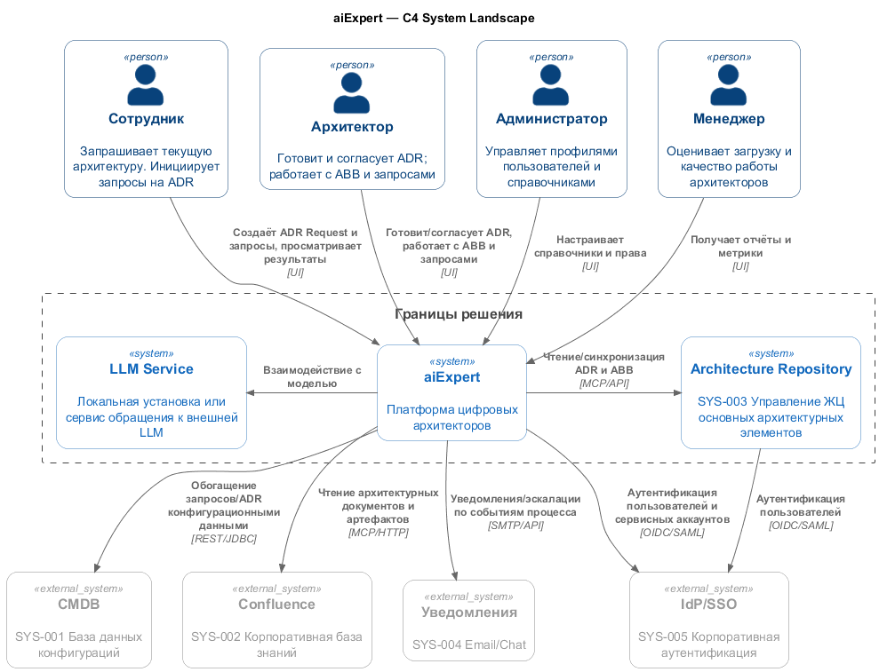

# Контекст решения `aiExpert` (C4 — System Landscape)

## Назначение решения

`aiExpert` — корпоративное ИТ‑решение для поддержки архитектурного процесса: приём и обработка запросов на архитектурные решения (**ADR Request**), подготовка и сопровождение **ADR**, работа с библиотекой **ABB**, а также отчётность по загрузке и статусам.

## C4 System Landscape diagram (PlantUML)

Диаграмма находится в файле `context-view.puml` и является каноничным System Landscape представлением контекста решения.

